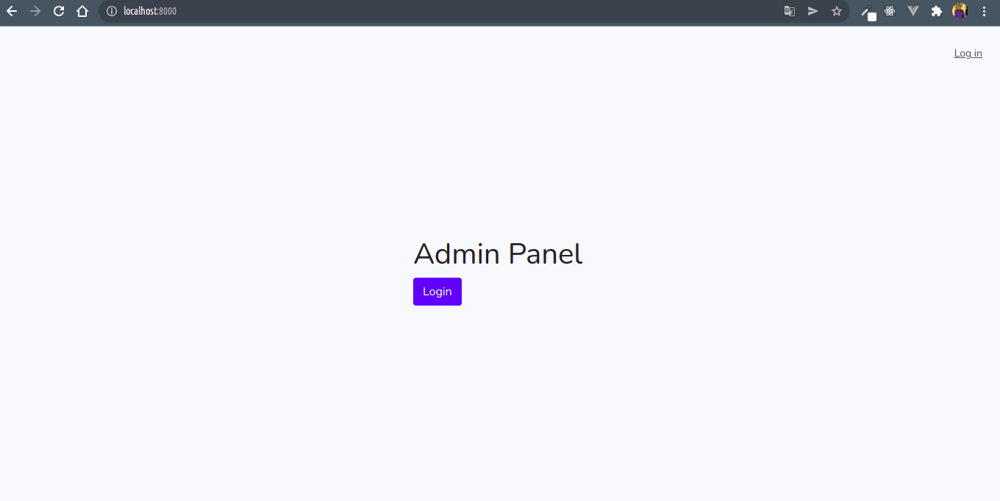
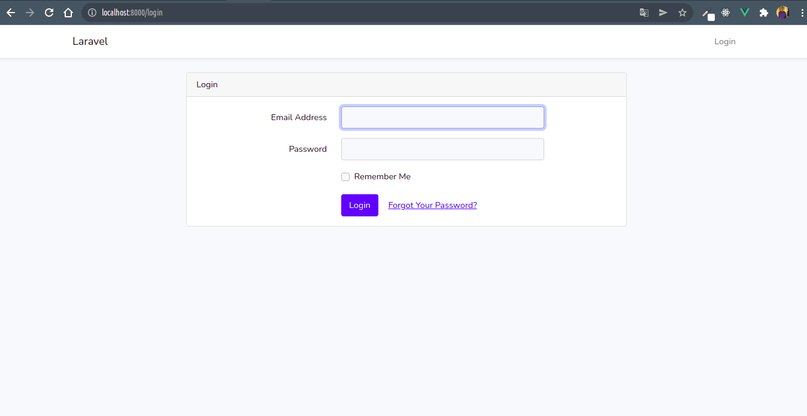

# Step 1
To start the clone project on github on the [link] (https://github.com/pierreahoble/admin_panel.git)


# Step 2
Also make sure you have composer installed Also make sure you have composer php dependency on your environment, You could install it via this [link] (https://getcomposer.org/)


# Step 3
After cloning the project and downloading you need to install composer ,in the root of the project directory. Make sure to open the project in a terminal and run the following command
`composer update or composer install`

# Step 4
For laravel authentication to work perfectly, also install node modules dependencies with this command line in the root of project directory `npm install` Also make sure you have installed. Also make sure you have npm on your environment.
You could install it via this [link] (https://nodejs.org)

# Step 5
You must also create an environment file at the root of the project. Name the file this way
`.env`

# Step 6
In the .env file, paste this,
at the root of the project you will find an `.env.example` file,
copy the information from this file and paste it into the `.env` file


# Step 7
After creating the .env file and pasting the information above, type this command
`php artisan key:generate`, Make sure you are still in the root of the project

# Step 8 
You had to modify the env file but first create your database
If you had wamp server or lamp server or download on this [link] (https://www.wampserver.com/en/)
After installing wamp server ,start your server
Connect to your database server and create your database

# Step 9
Let's configure our `.env` file
In your .env file at line 14 to line 16, you will find

```
DB_DATABASE=
DB_USERNAME=
DB_PASSWORD=
```
At level At line 14 put the name of your database
At level At line 15 put username of your database
At level At line 16 put database user password


# Step 10 
Create the tables in your database
Make sure you are in the root of the project directory, open your terminal or command prompt. Type this command to create the project or migration tables
`php artisan migrate`

# Step 11
Fill your database with fictitious information
Always make sure you are at the root of the project in your terminal type the following command to fill your database with information from a laravel library
`php artisan db:seed --class=DatabaseSeeder`

# Step 12 
In your terminal always type the command `php artisan serve` to start the laravel server

# Step 13
Your server will be started on the address localhost::port which will be displayed in your terminal
Or open your browser and type in your browser localhost::listening port of your server
After that you should have a homepage


# Step 14
Log in to the application, click on login to your right at the top corner, Or on the login button in the middle of the screen



# Step 15
To log in use as email address `admin@admin.com` and password `password`

## thank you peace!!!
